# 🍅 MichiDoro

[English](README.md) | [Español](README_ES.md)

MichiDoro is an open-source Pomodoro application built with Flutter and Dart for productivity, studying, and personal organization. It works primarily offline and keeps productivity data stored locally on the device.

> The project is being prepared for publication on F-Droid.

## ✨ Key features

- Pomodoro timer for structured focus periods.
- Work and break sessions.
- Personal task management.
- Goal management.
- Session history.
- Productivity statistics and reports.
- Primarily offline operation.
- Local productivity data storage.

## 🛠️ Technology stack

| Technology | Purpose |
| --- | --- |
| Flutter and Dart | Cross-platform application development |
| Material Design 3 | Components and visual system |
| Clean Architecture | Separation of responsibilities and dependencies |
| Feature First | Feature-based source organization |
| `go_router` | Declarative navigation |
| `get_it` | Dependency injection |
| `signals_flutter` | Reactive state management |
| Drift / SQLite | Local data persistence |
| `flex_color_scheme` | Theme and color management |
| `flutter_animate` | Interface animations |
| `responsive_framework` | Adaptation to different screen sizes |
| `toastification` | In-app messages and notifications |

## 🏗️ Project architecture

MichiDoro follows **Clean Architecture** with a **Feature First** structure. Each feature groups its own layers and components, while dependencies point toward the application's core.

```text
lib/
├── app/             # Global configuration, routing, themes, and injection
├── features/        # Source code organized by feature
│   └── feature/
│       ├── data/          # Data sources and implementations
│       ├── domain/        # Entities, contracts, and business logic
│       └── presentation/  # Pages, widgets, and controllers
├── l10n/            # Localization resources
└── shared/          # Reusable components
```

This structure supports testing, maintainability, and the addition of new features without coupling the interface to persistence.

## 📋 Requirements

Before running the project, make sure you have:

- [Git](https://git-scm.com/).
- [Flutter SDK](https://docs.flutter.dev/get-started/install) 3.32 or later.
- Dart 3.8 or later, included with Flutter.
- A Flutter-compatible device or emulator.

Check your development environment with:

```bash
flutter doctor
```

## 🚀 Installation and usage

Clone the repository, install the dependencies, and run the application:

```bash
git clone https://github.com/Chriss-12/michidoro.git
cd michidoro
flutter pub get
flutter run
```

List the available devices with:

```bash
flutter devices
```

## 🔒 Privacy

MichiDoro is designed to work primarily offline. Tasks, goals, sessions, and productivity statistics are stored locally on the device using Drift and SQLite.

The application's core features do not require a remote service. Before distributing a build, review the permissions and privacy metadata required by F-Droid.

## 📱 Screenshots

<table>
  <tr>
    <td align="center">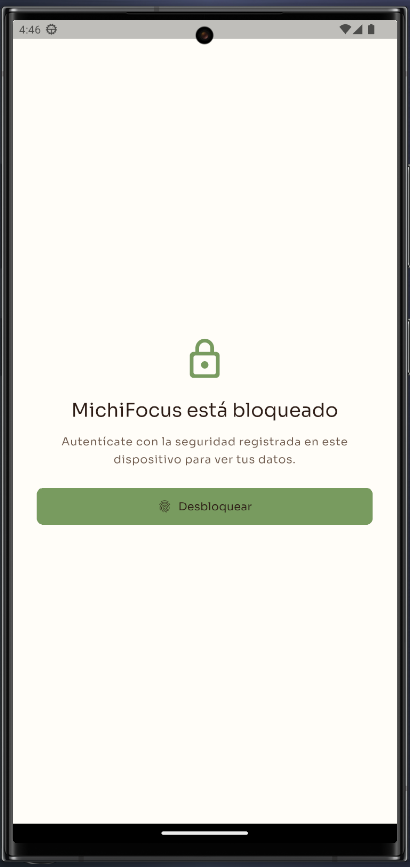<br><sub>001-image.png</sub></td>
    <td align="center">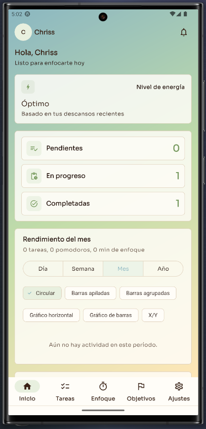<br><sub>002-image.png</sub></td>
    <td align="center">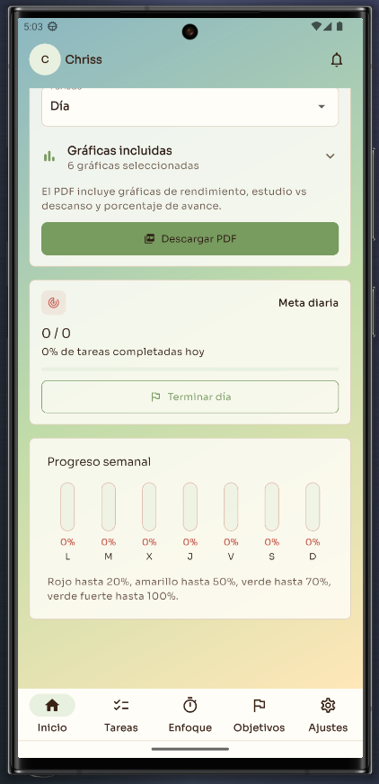<br><sub>003-image.png</sub></td>
  </tr>
  <tr>
    <td align="center">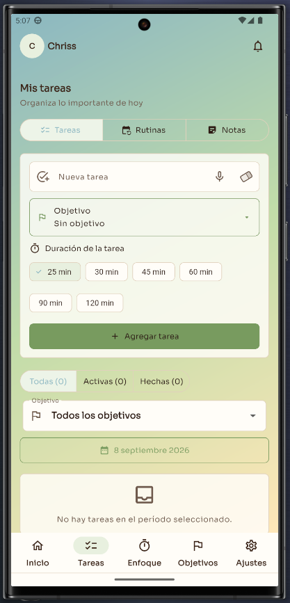<br><sub>004-image.png</sub></td>
    <td align="center">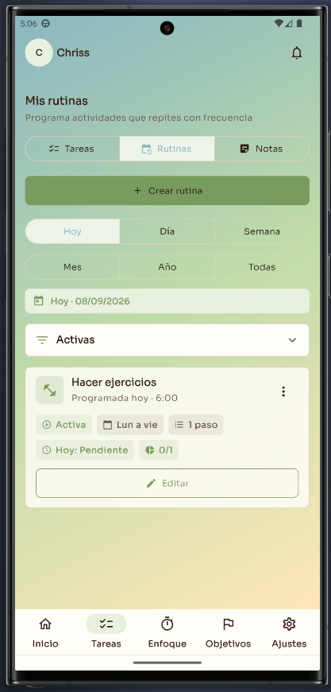<br><sub>005-image.png</sub></td>
    <td align="center">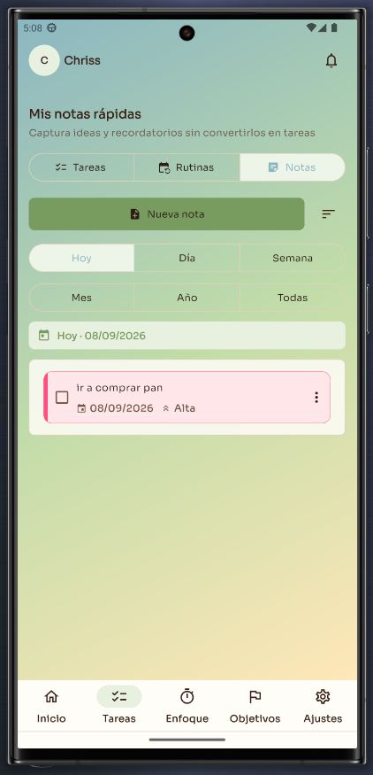<br><sub>006-image.png.png</sub></td>
  </tr>
  <tr>
    <td align="center">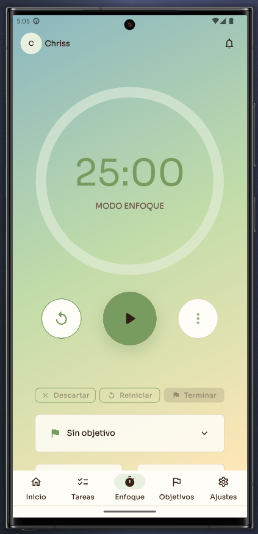<br><sub>007-image.png</sub></td>
    <td align="center">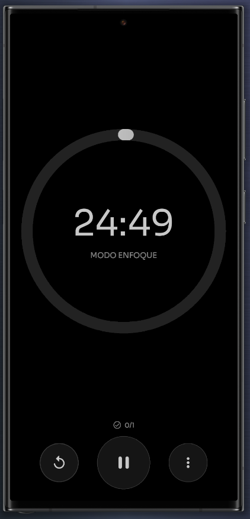<br><sub>008-image.png</sub></td>
    <td align="center">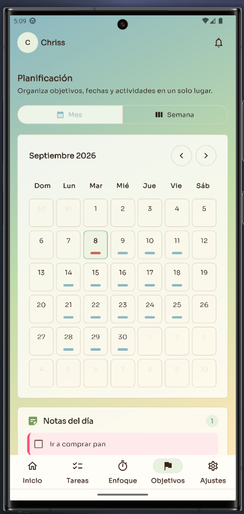<br><sub>009-image.png</sub></td>
  </tr>
  <tr>
    <td align="center">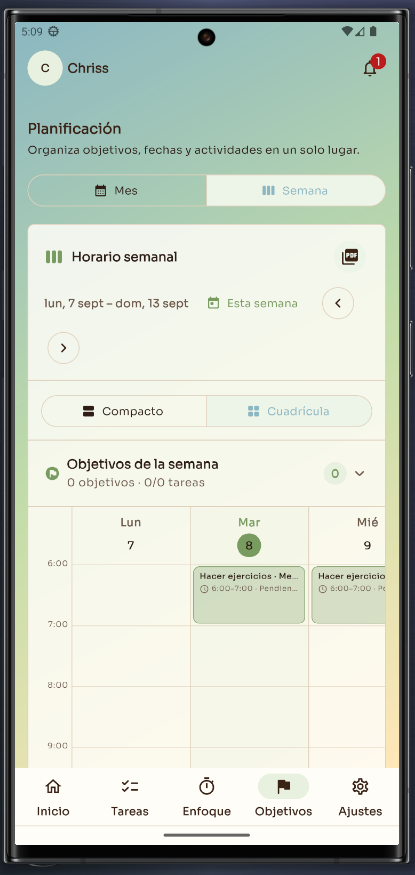<br><sub>010-image.png</sub></td>
    <td align="center">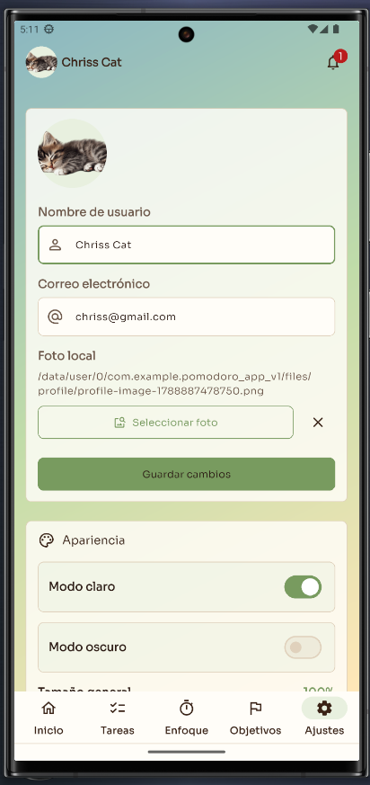<br><sub>011-image.png</sub></td>
    <td align="center">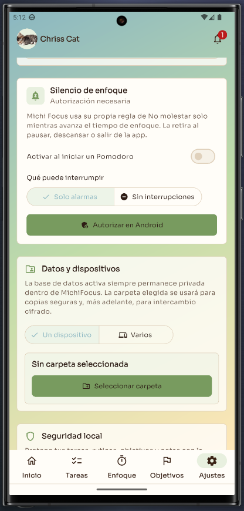<br><sub>012-image.png</sub></td>
  </tr>
  <tr>
    <td align="center">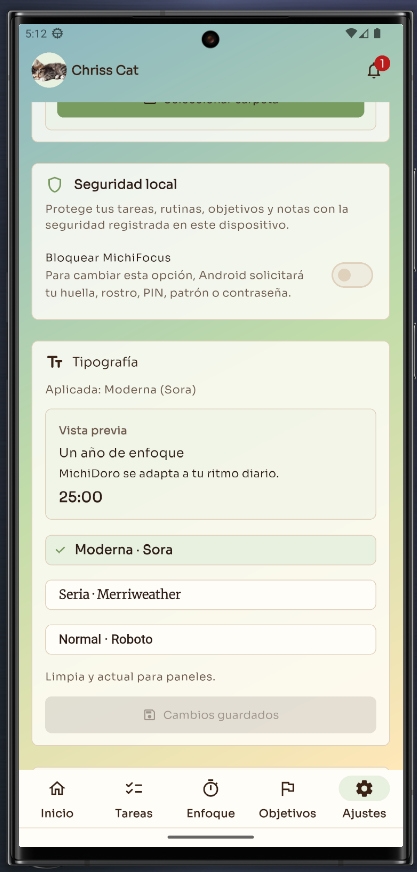<br><sub>013-image.png</sub></td>
    <td align="center">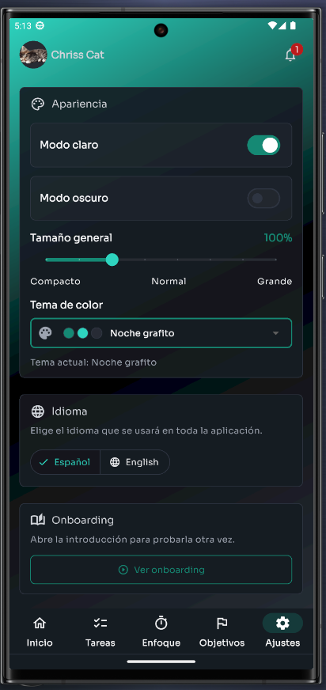<br><sub>014-image.png</sub></td>
    <td align="center">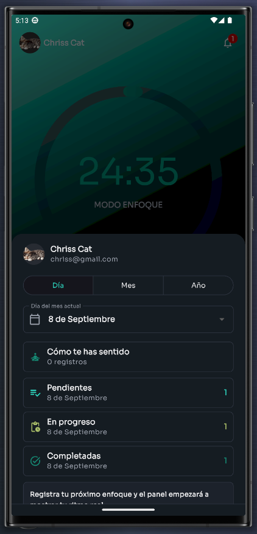<br><sub>015-image.png</sub></td>
  </tr>
  <tr>
    <td align="center">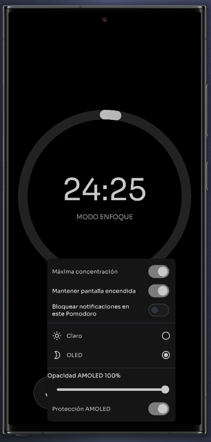<br><sub>016-image.png</sub></td>
    <td align="center">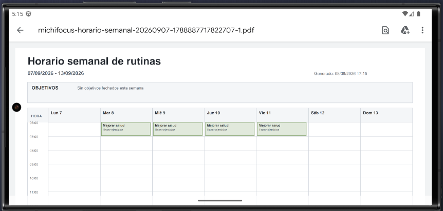<br><sub>017-image.png</sub></td>
    <td></td>
  </tr>
</table>

## 🤝 Contributing

Contributions are welcome. To propose a change:

1. Fork the repository.
2. Create a descriptive branch for your contribution.
3. Implement the change following the existing architecture.
4. Run analysis and tests before submitting it.
5. Open a pull request that clearly explains the problem and the solution.

Recommended verification commands:

```bash
flutter analyze
flutter test
```

Before contributing, review the open issues and do not include personal data, generated files, or credentials in commits.

## 📄 License

This project is distributed under the **GNU General Public License v3.0**. See [LICENSE](LICENSE) for the full terms.

## 👤 Author

**Cristhian Alave**

GitHub: [@Chriss-12](https://github.com/Chriss-12)

---

Official repository: [github.com/Chriss-12/michidoro](https://github.com/Chriss-12/michidoro)
